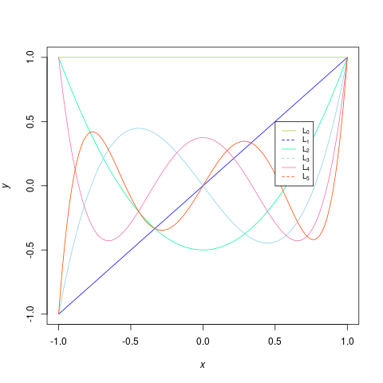

# Assignment 1 - Machine Learning

In this assignment I look at over-fitting and how noise,the amount of data and the complexity influence
over-/under- fitting of data generated by an nth degree polynomial. The polynomials used are
Legendre polynomials which are expressed in the equation below. In ”Task 1” an introduction to
the Legendre polynomials are presented and their use in the target function used in this project.
”Task 2” simulate a fitting problem by generating data sets from a Legendre polynomial and adding
different amount of noise it. Then different ordered Legendre polynomials are fitted to the data set.
For more, please read the "assignment1Report" pdf.

#### Legendre polinomial of *q*-th order

\\[ L(x) = 2^q \sum_{k=0}^{q} x^k \binom{q}{k} \binom{\frac{q+k-1}{2}}{q}\\]

